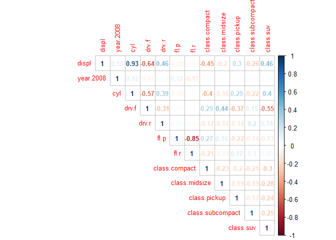
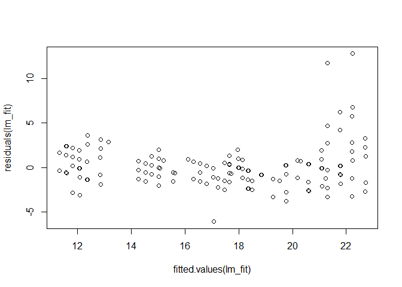
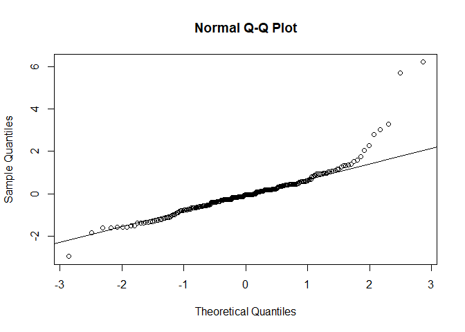

Framework for linear regression in R
================
V Avlani

-   [Motivation](#motivation)
-   [What *won't* be covered here](#what-wont-be-covered-here)
-   [Dataset for this exercise](#dataset-for-this-exercise)
-   [Pre-modeling assumptions](#pre-modeling-assumptions)
    -   [Creating dummy variables](#creating-dummy-variables)
    -   [Observations &gt; predictors](#observations-predictors)
    -   [No linear dependencies](#no-linear-dependencies)
    -   [Remove constant features](#remove-constant-features)
    -   [Near-zero-variance columns](#near-zero-variance-columns)
    -   [Multicollinearity](#multicollinearity)
    -   [Centering & Scaling *(needed sometimes)*](#centering-scaling-needed-sometimes)
-   [Modeling the linear regression](#modeling-the-linear-regression)
-   [Evaluating the model](#evaluating-the-model)
    -   [Mean of residuals = 0](#mean-of-residuals-0)
    -   [Homoscedasticity or equal variance of error terms](#homoscedasticity-or-equal-variance-of-error-terms)
    -   [Normality of residuals](#normality-of-residuals)
-   [Other considerations](#other-considerations)

Motivation
----------

This codebook serves as a reference for performing a linear regression using R. It includes the steps that you would need to perform in order to perform and validate the results of a linear regression model. There maybe some steps which may not be always be needed but the purpose of this is to be a kind of exhaustive reference page for anything related to linear regression.

> *Far better an approximate answer to the right question, which is often vague, than the exact answer to the wrong question, which can always be made precise.* John Tukey

There are a lot of assumptions that a linear regression model makes and they need to be satisfied if we want to make correct inferences from the generated model. The steps below go through the important assumptions and enable us to quickly check if they are valid.

What *won't* be covered here
----------------------------

We will not be covering the data pre-processing part here. Pre-processing often involves a lot of steps and can get pretty complicated with real world data - That won't be covered here but there are lots of good resources out there which cover this in great detail: `dplyr` and `tidyverse` in general are great packages which allow you to do a lot of data manipulation very elegantly. [R for Data Science](%22http://r4ds.had.co.nz/%22) is a great free resource by Hadley Wickham for learning more about these 2 packages.

We will be assuming that the starting point is you have a dataset with properly encoded factors (we will perform one-hot encoding as part of this exercise) and numerical features that you want to put into the linear regression model.

Dataset for this exercise
-------------------------

We will be using the mpg dataset found in ggplot2 package. We will be doing just a bit of clean up like converting the char columns and year to factors and removing model, manufacturer and trans from the data frame because they have too many levels. If the motivation of this exercise was to get the bese possible accuracy, we should probably think of ways of bucketing the levels and incorporating these into the model. But for now, we can just drop them.

We will also remove the hwy (highway mileage) from the dataset since we are going to be predicting the cty (city mileage) and we don't want to use hwy mileage to predict cty.

The code below performs the required clean up.

``` r
library(tidyverse)
library(caret)
library(corrplot)

df <- mpg

# Drop the variables with more than 10 levels
df <- select(df, -manufacturer, -model, -trans, -hwy)

# Convert year, class, drv, and fl to factors
df$year <- as.factor(df$year)
df$class <- as.factor(df$class)
df$drv <- as.factor(df$drv)
df$fl <- as.factor(df$fl)
```

Pre-modeling assumptions
------------------------

There are steps and assumptions that must be validated before we actually train the data using linear regression model.

The pre-modeling assumptions that we will consider here are:

-   Creating dummy variables

-   Number of observations &gt; than the number of predictors

-   No linear dependencies or combinations

-   Remove constant features

-   Remove near zero variance features

-   Multicollinearity

-   Centering and Scaling

Some of these might not be needed depending on your particular problem and some options might need to be tweaked based on the application (for eg. the threshold for the variance cutoff for considering a column to be near zero variance). *One size fits all* solutions are hard to come by in these situations.

### Creating dummy variables

This is a fairly straightforward step where we create dummy variables for all of our factor variables. For linear regression, we need to make sure that we remove one of the levels from the columns for each factor variables to avoid linear combinations of columns. So a 3-level factor variable should result in the creation of 2 new dummy variable columns and not 3 new columns.

``` r
# Create dummy variables
# Note that only calling predict actually returns the df with
# dummy variables - dummyVars just returns a model and the predict function returns a data frame
# Note we make fullRank = TRUE to drop linear dependencies
dummy_vars <- dummyVars(cty ~ ., data = df, fullRank = TRUE)
df_x <- predict(dummy_vars, newdata = df)

# Note that df_x won't have the target variable (cty in this case)
# We would need to bind cty and df_x together again in a new df
df <- data.frame(cbind(cty = df$cty, df_x))
head(df, n=3)
```

    ## # A tibble: 3 x 16
    ##     cty displ year.2008   cyl drv.f drv.r  fl.d  fl.e  fl.p  fl.r
    ## * <dbl> <dbl>     <dbl> <dbl> <dbl> <dbl> <dbl> <dbl> <dbl> <dbl>
    ## 1    18   1.8         0     4     1     0     0     0     1     0
    ## 2    21   1.8         0     4     1     0     0     0     1     0
    ## 3    20   2           1     4     1     0     0     0     1     0
    ## # ... with 6 more variables: class.compact <dbl>, class.midsize <dbl>,
    ## #   class.minivan <dbl>, class.pickup <dbl>, class.subcompact <dbl>,
    ## #   class.suv <dbl>

### Observations &gt; predictors

For running linear regression, we need to make sure that the number of columns is more than the number of rows otherwise the model won't run. If we do have a case like that, we might want to explore regularization methods like Lasso and Ridge regression.

Even if they are close, we should reconsider our approach by removing some of the columns from our analyses.

A simple check.

``` r
# Check that rows > columns
dim(df)[1]>dim(df)[2]
```

    ## [1] TRUE

``` r
# Actual number of rows and columns
dim(df)
```

    ## [1] 234  16

### No linear dependencies

We need to ensure that there are no linear dependencies among the variables for linear regression. It may be ok with some machine learning algorithms but it will cause problems for linear regresion. We ensured that converting to dummy variables doesn't cause linear dependencies by putting `fullRank = TRUE` but we should still do a check.

We can use the `caret` package to check for linear combinations. In our case there are no linear combinations and $remove returns NULL value.

``` r
comboInfo <- findLinearCombos(df)

# If there are linear dependencies remove the columns which are causing it
# Otherwise $remove will result a NULL value
if (!(is.null(comboInfo$remove))) {
  df <- select(df, -comboInfo$remove)
}

comboInfo
```

    ## $linearCombos
    ## list()
    ## 
    ## $remove
    ## NULL

### Remove constant features

We want to remove columns which only have a single unique value - since that has no predictive power. Leaving such columns in causes some models to crash or fit is often unstable. It causes problems for linear regression although some machine learning algorithms automatically remove such column before training.

We don't expect such columns in a clean dataset like ours but in real-world data there are often stray columns like these.

``` r
# If we want details about each column, we put saveMetrics = TRUE
# Otherwise nzv would just be a vector of columns which have near zero variance
nzv <- nearZeroVar(df, saveMetrics = TRUE)
nzv
```

    ## # A tibble: 16 x 4
    ##    freqRatio percentUnique zeroVar nzv  
    ##  *     <dbl>         <dbl> <lgl>   <lgl>
    ##  1      1.08         8.97  FALSE   FALSE
    ##  2      1.05        15.0   FALSE   FALSE
    ##  3      1            0.855 FALSE   FALSE
    ##  4      1.03         1.71  FALSE   FALSE
    ##  5      1.21         0.855 FALSE   FALSE
    ##  6      8.36         0.855 FALSE   FALSE
    ##  7     45.8          0.855 FALSE   TRUE 
    ##  8     28.2          0.855 FALSE   TRUE 
    ##  9      3.5          0.855 FALSE   FALSE
    ## 10      2.55         0.855 FALSE   FALSE
    ## 11      3.98         0.855 FALSE   FALSE
    ## 12      4.71         0.855 FALSE   FALSE
    ## 13     20.3          0.855 FALSE   TRUE 
    ## 14      6.09         0.855 FALSE   FALSE
    ## 15      5.69         0.855 FALSE   FALSE
    ## 16      2.77         0.855 FALSE   FALSE

``` r
# Checking for zero var columns - there are none in our dataset
nzv[nzv$zeroVar,]
```

    ## # A tibble: 0 x 4
    ## # ... with 4 variables: freqRatio <dbl>, percentUnique <dbl>,
    ## #   zeroVar <lgl>, nzv <lgl>

``` r
# We want to remove columns where zeroVar is true
if (length(which(nzv[,"zeroVar"] > 0)) > 0) {
  df <- df[,-(which(nzv[,"zeroVar"] > 0))]
}
```

### Near-zero-variance columns

We pretty much never want to include zero variance columns but when columns are near zero variance ie they either have very few unique values or the number of observations for some values is very less.

We should test the performance of the model, before and after removing such columns. Removing them may affect performance.

One concern with such columns is that when we split the data into test and train, some of the values maybe completely missing in one of the datasets. This will lead to problems and you should think about removing such columns.

The freqRatio and percentUnique help us determine when to classify a column as near zero variance. We can learn more about these metrics from the `caret` [documentation](%22https://topepo.github.io/caret/pre-processing.html#zero--and-near-zero-variance-predictors%22).

> **freqRatio**: the frequency of the most prevalent value over the second most frequent value

> **percentUnique**: number of unique values divided by the total number of samples

If freqRatio is greater than some threshold and percentUnique is less than some threshold you can consider it to be near-zer-var. We can control these thresholds and tune them to our liking.

For this example, we are going to go with the defaults.

``` r
# Much simpler form when saveMetrics = FALSE
# Return column numbers of the columns where nearZeroVar or nzv = TRUE
nzv <- nearZeroVar(df)
nzv
```

    ## [1]  7  8 13

``` r
# Remove these columns from dataset
df <- df[-nzv]
```

### Multicollinearity

We have two options to deal with multicollinearity - either we identify it before our modeling and training by using pairwise correlations or we get the VIF after we train the model and then adjust the model by removing the high VIF predictors one by one.

We are going with the first method here - where we identify the highly correlated predictors.

caret package is our friend here again.

``` r
# Create a correlation matrix for the predictors
df_x <- select(df, -cty)
cor_mat <- cor(df_x)
# Plot the correlation matrix for inspection
corrplot(cor_mat, method = "number", type = "upper", 
         number.cex = 0.8, tl.cex = 0.8, cl.cex = 0.8)
```



``` r
# Find the correlated columns with 85% cutoff; it will return 1 column
# from each pair of correlated column so that we can delete it
high_cor <- findCorrelation(cor_mat, cutoff = .85)
high_cor
```

    ## [1] 1 6

``` r
# Create the final data frame with the correlated columns deleted
df <- data.frame(cbind(cty = df$cty, select(df_x, -high_cor)))
```

### Centering & Scaling *(needed sometimes)*

When we are planning to introduce interaction terms or higher order terms X^2, X^3, etc – centering helps to remove the collinearity – without centering they would generally have a much higher correlation – same with interaction terms like `X1*X2`.

When we plan to do PCA, the variables must be centered by their means.

Scaling is often useful when you want to add 2 variable which are on different scales – like ratings from 1 to 10 and 1 to 100 – Also when one variable has a very large scale - to make the coefficient more manageable.

There’s nothing wrong with always centering and scaling your predictors.

There is a great discusssion on StackOverflow [here](%22https://stats.stackexchange.com/questions/29781/when-conducting-multiple-regression-when-should-you-center-your-predictor-varia%22)

`preProcess` function in the caret package has helper functions which can transform your data in multiple ways, making it very eaasy to apply a variety of transformations.

``` r
# We only want to center and scale the numeric features and not dummy vars
# In this case we only have 1 variable
df_pre_proc <- select(df, cyl)

# Setup the preprocessing function with required methods
# There are a lot more methods that you can specify in preprocess
pre_proc <- preProcess(df_pre_proc, method = c("center", "scale"))

# predict function is the one which actually preprocesses the data
df_x_transform <- predict(pre_proc, df_pre_proc)

# Merge the categoricals and the processed columns together again
df <- data.frame(cbind(select(df, -cyl), df_x_transform))
```

Modeling the linear regression
------------------------------

You can use either `lm()` or the `train()` function in caret where `method = “lm”`. The `caret` package is a meta-modeling package which provides a common interface for many different types of learning algorithms. The `lm()` function allows you to plot different kinds of diagnostic tests which are useful in evaluating the model. We will be using the `caret` package to perform our analyses.

We will use 5-fold cross validation to evaluate our model and also create some diagnostic plots to assess the accuracy of the model and see if any of the assumptions are violated. There are also other lm methods like leapforward and leapbackward, stepwise selection algorithms in the caret package – leapSeq, lmStepAIC. These are automatic feature selection algorithms that are sometimes useful but are mostly bad ideas since they don't always agree and are not guaranteed to find the best solution.

In general, we would spend some time trying out new models by adding and subtracting new features, trying interaction terms, creating new features but here the focus of the work is on the process of developing a linear regression model and not necessarily finding the best model. So we have only tried out 1 model with all the variables.

``` r
# You can specify the cross-validaton setup in trainControl
# Here we choose 5-fold CV
train_control <- trainControl(method = "cv", number = 5)

lm_fit <- train(x = select(df, -cty), y = df$cty, method = "lm",
                trControl = train_control)

# Displays the cross-validated RMSE & R-squared
lm_fit
```

    ## Linear Regression 
    ## 
    ## 234 samples
    ##  10 predictor
    ## 
    ## No pre-processing
    ## Resampling: Cross-Validated (5 fold) 
    ## Summary of sample sizes: 187, 189, 187, 186, 187 
    ## Resampling results:
    ## 
    ##   RMSE      Rsquared   MAE     
    ##   2.137775  0.7573912  1.473692
    ## 
    ## Tuning parameter 'intercept' was held constant at a value of TRUE

``` r
# Summary of the fit
summary(lm_fit)
```

    ## 
    ## Call:
    ## lm(formula = .outcome ~ ., data = dat)
    ## 
    ## Residuals:
    ##     Min      1Q  Median      3Q     Max 
    ## -6.0714 -1.1808 -0.0894  0.8654 12.7668 
    ## 
    ## Coefficients:
    ##                   Estimate Std. Error t value Pr(>|t|)    
    ## (Intercept)      14.706934   0.712563  20.640  < 2e-16 ***
    ## year.2008         0.489192   0.281846   1.736  0.08400 .  
    ## drv.f             2.039225   0.501198   4.069 6.56e-05 ***
    ## drv.r             0.781014   0.575956   1.356  0.17646    
    ## fl.r             -0.013164   0.336692  -0.039  0.96885    
    ## class.compact     1.771838   0.652300   2.716  0.00712 ** 
    ## class.midsize     1.073090   0.644097   1.666  0.09711 .  
    ## class.pickup     -0.262553   0.802449  -0.327  0.74383    
    ## class.subcompact  2.699542   0.663622   4.068 6.58e-05 ***
    ## class.suv        -0.003588   0.712207  -0.005  0.99599    
    ## cyl              -2.378193   0.201620 -11.795  < 2e-16 ***
    ## ---
    ## Signif. codes:  0 '***' 0.001 '**' 0.01 '*' 0.05 '.' 0.1 ' ' 1
    ## 
    ## Residual standard error: 2.105 on 223 degrees of freedom
    ## Multiple R-squared:  0.7658, Adjusted R-squared:  0.7553 
    ## F-statistic:  72.9 on 10 and 223 DF,  p-value: < 2.2e-16

Evaluating the model
--------------------

The basic evaluation includes just checking the RMSE on either the test dataset (we haven't done that here) or check the CV error by just printing out the fitted model.

Apart from this we also want to ensure that other assumptions of the linear model are not being violated here like:

-   Mean of residuals is 0

-   Homoscedasticity (equal variance) of residuals

-   Residuals vs fitted values

-   Normality of residuals

We'll cover how to check each of these in turn.

### Mean of residuals = 0

This is a simple check where we want to ensure that the residuals are 0

``` r
mean(residuals(lm_fit))
```

    ## [1] 1.088187e-17

### Homoscedasticity or equal variance of error terms

We can plot the residuals vs fitted values to get an idea - it seems like there is slight increase in variance with fitter values.

We can resolve this by transforming the y variable using log transform or Box-Cox transformation to make it more normal. We can then again fit the model and replot this.

``` r
plot(fitted.values(lm_fit), residuals(lm_fit))
```



### Normality of residuals

We need to plot a qqnorm plot to check - if the points lie on a straight line, they are said to be normal.

Residuals appear to be normally distributed

``` r
qqnorm(y = scale(residuals(lm_fit), center = TRUE))
qqline(y = scale(residuals(lm_fit), center = TRUE))
```



Other considerations
--------------------

We didn't cover everything that would be required in every situation but these steps should cover about 80% of the scenarios for linear regression.

We could additionally look into transforming the y variable if it isn't normally distributed. This often improves the fit and the accuracy for a lot of models and not just linear ones.

Other things we could explore are using subset selection methods from the caret package - like forward and backward selection as well as stepwise selection. Although they are not guranteed to find the best model.
